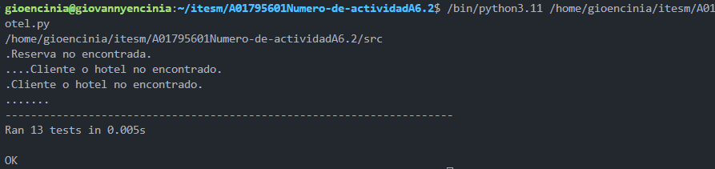
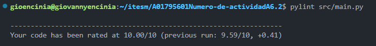
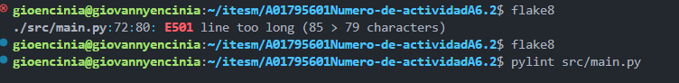

# A01795601Numero-de-actividadA6.2
## Ejercicio de programación 3 y pruebas de unidad

 Las clases se encuentran en src/main
 Las pruebas unitarias se encuentran en test_hotel.py
 Los datos de prueba los podemos encontrar en el folder data

 Para correr las pruebasd unitarias simplemente corremos el archivo test_hotel.py

## Resultados
 En seguida se muestran los resultados de las pruevas unitarias y estaticas.

### Resultados de las unit test

### Resultados Pylint

### Resultados Flake8
